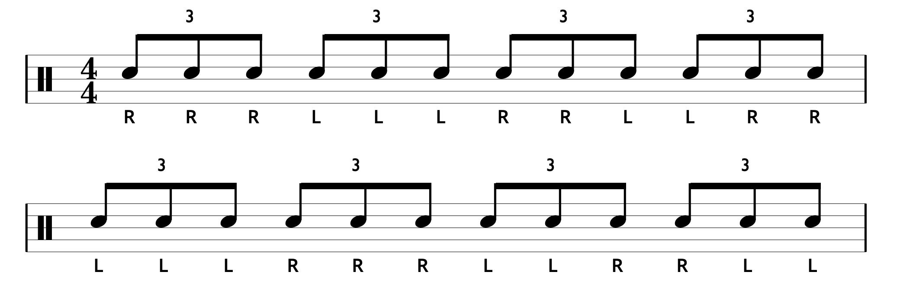

::: {.callout-note collapse="true" .tight-stack}
## 1주차 요약 2026-03-01

별 얘기 안함.

[이전꺼 슬라이드로 된거 보기](assets/likitung.qmd) <- 이제 업뎃 안함. 여기서 쭉 할거임.
:::

::: {.callout-note collapse="true" .tight-stack}
## 2주차 요약 2026-03-15

* 팔을 힘없이 내린 상태로 팔꿈치만 굽혀서 편안한 자세 만들기, 
* 이제부터 **모든 연습은 Full or Down 스트로크로 연주**하기, 
* 강약조절은 4단계: 
  + **4️⃣** 악센트(음표 위에 >),
  + **3️⃣** 평타 RL,
  + **2️⃣** 짤짤이 rl,
  + **1️⃣** 고스트노트 (음표에 괄호친거)

주간 숙제는 [여기](files/weekpra01.pdf)에.
:::

::: {.callout-note collapse="false" .tight-stack}
## 3주차 요약 2026-03-29

* 킥 앞꿈치로 밟기, 
* Down 스트로크는 때리고 나서 높이 5cm 이내로 유지, 

:::

## 매일 해야하는 숙제 4개(주 3회 이상) {#daypra}

### 싱글 스트로크 {#daypra01}

* 16회 반복이 1세트, 틀리면 처음부터 다시, 목표 = 200
* 하루 4세트, BPM 60 ➡️ 70 ➡️ 80 ➡️ 90

{fig-align=center}

::: {.callout-tip collapse="true"}

## 옳게된 스트로크 보기

* 첫번째가 제일 잘된 싱글스트로크. 딱 저정도로 자연스럽게 손가락 열려도 됨.
* 두번째처럼 손가락 열리면 안됨. 손가락 열어서 하는 스트로크는 따로 있음.

::: {layout-ncol="2" fig-align="center"}

<video src="vid/IMG_6469_1.mp4" autoplay loop muted playsinline style="width: 300px; border-radius: 8px;"></video>

<video src="vid/IMG_6469_2.mp4" autoplay loop muted playsinline style="width: 300px; border-radius: 8px;"></video>

:::

:::

### 4 to 8 좌우 단련 {#daypra02}

* 16회 반복이 1세트, 틀리면 처음부터 다시, 목표 = 100
* 하루 4세트, BPM 60 ➡️ 70 ➡️ 75 ➡️ 80

{fig-align=center}

### 16분음표 국밥 패턴 {#daypra03}

* 영상 완주가 1세트, 틀리면 그 레벨 처음부터 다시.
* 하루 1세트, 1배속, 손목에 힘빼고 치기.
* 이런저런 패턴들의 나열에 익숙해지는 것이 목표
* 마지막 업뎃: 4월 6일



## 매주 숙제 (주 1회) {#weekpra}

* 이거 잘모르겠으면 카톡하셈
* 16회 반복이 1세트, 틀리면 처음부터 다시, 목표 = 150
* 4세트, BPM 60 ➡️ 70 ➡️ 80 ➡️ 90

{fig-align=center}

## 듣기 숙제

* 요즘 젊은이들은 잘 듣지를 않아.
* [이 악보](files/mymusicfive_298531_[Boaz Jo] Welove - 사랑을 나눠요.pdf)를 **보면서** 음원 쭉 정주행하기(Welove 사랑을 나눠요).
* 어느 음표가 어느 악기를 연주한 것인지 구별해보자!
* 어느 기호가 어떤 주법을 표현한 것인지 생각해보자!

