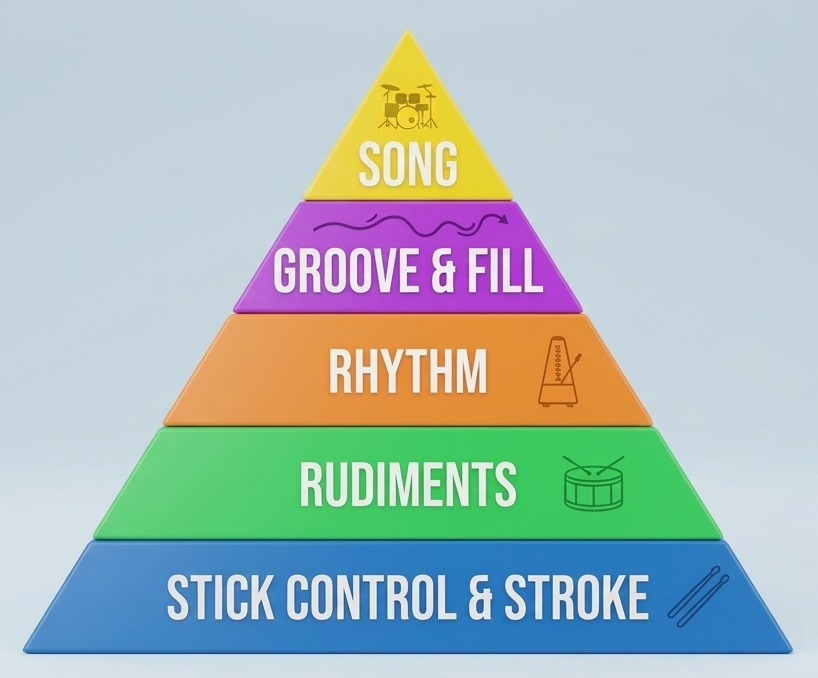
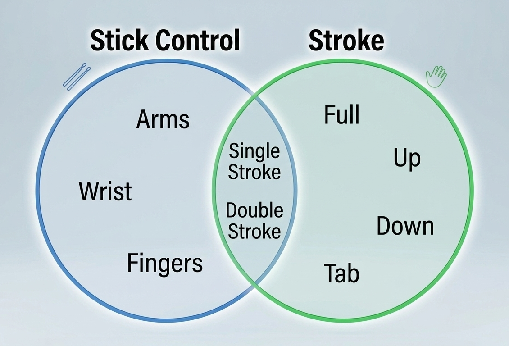
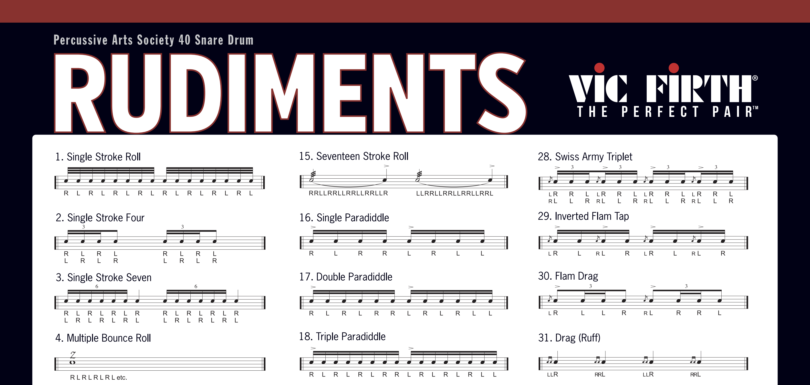
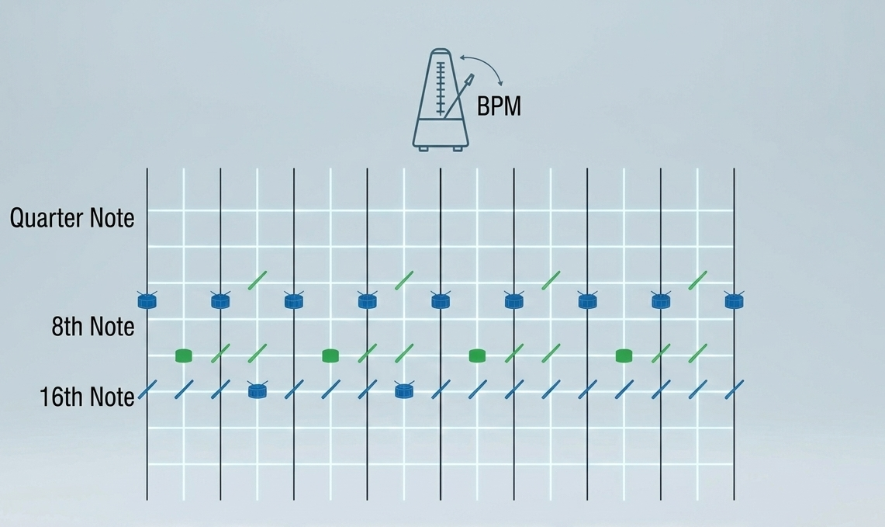
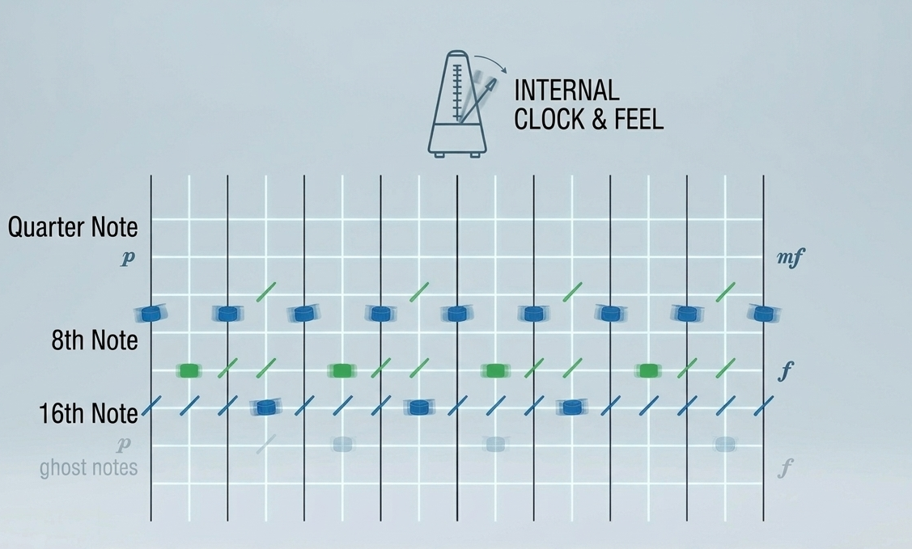
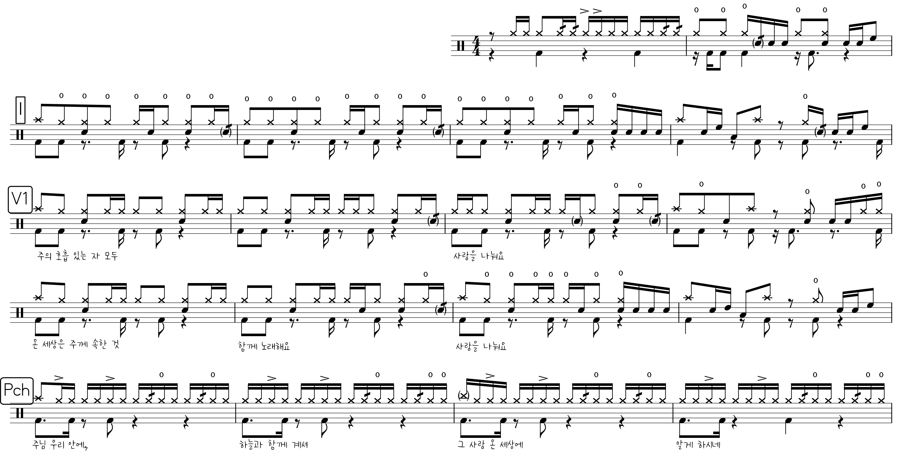

## 기초

{fig-align=center}

---

### Stick control & Stroke

{fig-align=center}

---

### Rudiments

{fig-align=center}

---

### Rhythm

{fig-align=center}

---

### Groove & Fill

{fig-align=center}

---

### Song

{fig-align=center}

## Daily Practice

### 4 to 8 turnaround

::: {.callout-tip appearance="simple"}
**GOAL: BPM 100**
:::

{fig-align=center}

