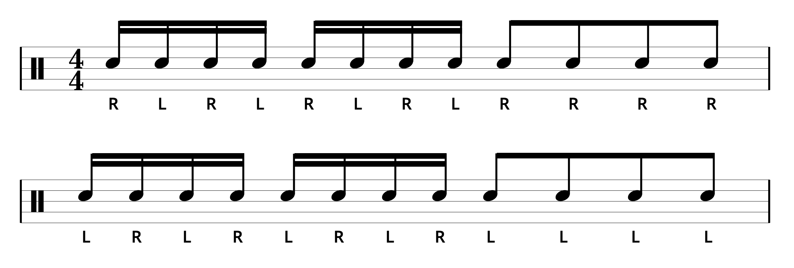
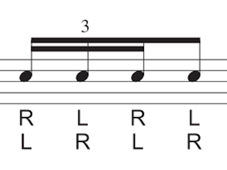
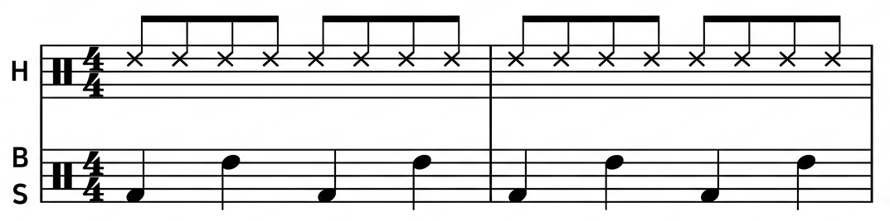

이 문서는 **드럼 중수가 되기 위한 비법서**다.[^1]

[^1]: 이 비법서를 잘 숙지하고 따르면 엄청난 속도로 드럼 중수가 될 수 있다고 전해진다.

::: {.callout-note collapse="true"}
## 1주차 요약 2026-03-01

별 얘기 안함.

[이전꺼 슬라이드로 된거 보기](assets/likitung.qmd) <- 이제 업뎃 안함. 여기서 쭉 할거임.
:::

::: {.callout-note collapse="false"}
## 2주차 요약 2026-03-15

* 팔을 힘없이 내린 상태로 팔꿈치만 굽혀서 편안한 자세 만들기, 
* 이제부터 **모든 연습은 Down 스트로크로 연주**하기, 
* 강약조절은 4단계: 
  + **4️⃣** 악센트(음표 위에 >),
  + **3️⃣** 평타 RL,
  + **2️⃣**짤짤이 rl,
  + **1️⃣** 고스트노트 (음표에 괄호친거)
:::

## 매일 해야하는 숙제 4개 {#daypra}

### 싱글 스트로크 {#daypra01}

::: {.callout-important}
## 16회 반복이 1세트, 틀리면 처음부터 다시, 목표 = 200

하루 4세트, BPM 60 ➡️ 65 ➡️ 70 ➡️ 75
:::

{fig-align=center}

::: {.column-margin}
이게 Single Stroke Roll 임.
:::

### 4 to 8 좌우 단련 {#daypra02}

::: {.callout-important}
## 16회 반복이 1세트, 틀리면 처음부터 다시, 목표 = 100

하루 4세트, BPM 60 ➡️ 60 ➡️ 65 ➡️ 65
:::

{fig-align=center}

### 16분음표 국밥 패턴 {#daypra03}

::: {.callout-important}
## 영상 완주가 1세트, 틀리면 처음부터 다시,

하루 1세트, 1배속, 손목에 힘빼고 치기.

이런저런 패턴들의 나열에 익숙해지는 것이 목표
:::



### 셋잇단음표 6연음 박자감 익히기 {#daypra04}

::: {.callout-important}
## 16회 반복이 1세트, 틀리면 처음부터 다시, 

하루 4세트, BPM 45 ➡️ 50 ➡️ 55 ➡️ 60
:::

{fig-align=center}

::: {.column-margin}
2박, 4박은 6연음말고 이걸로 치셈.

Single Stroke 4

{width="200"}
:::

---
## 매주 숙제 (주 1회) {#weekpra}

### 스틱 컨트롤 기초 {#weekpra01}

::: {.callout-important}
## 각 악절(번호)당 16회 반복, 틀려도 계속하기, BPM 80

.pdf로 메모하면서 볼거면 [여기](files/weekpra01.pdf) 누르셈. 밑에 이미지 클릭은 커지기만 함.
:::

아마 진짜 지루하고 하품오는 순간 많을 거임. 근데 그래도 꾹참고 해보셈. 
이거 이번주만 하고 안할거임. 
인생 살면서 딱 한번만 하고 넘어가는 연습임! 

근데 이제 효과는 확실한. thanks me later 😎

{fig-align=center}

## 리듬 연습

### 국밥 8비트

{fig-align=center}

* 원래 드럼악보 이렇게 안쓰고 한줄에 다씀
* 지금은 보기 편하라고 나눠서 쓴거임
* 8비트만 칠줄 알아도 CCM 곡 35% 연주 가능