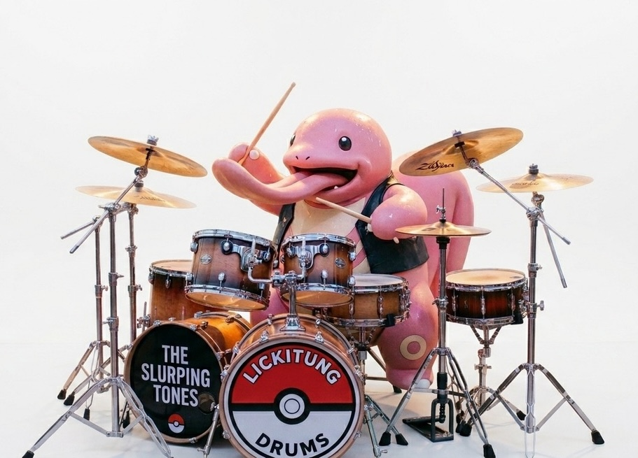

{fig-alt="문지은"}

::: {.callout-note collapse="true" .tight-stack}
## 1주차 요약 2026-03-01

별 얘기 안함.

[이전꺼 슬라이드로 된거 보기](assets/likitung.qmd) <- 이제 업뎃 안함. 여기서 쭉 할거임.
:::

::: {.callout-note collapse="true" .tight-stack}
## 2주차 요약 2026-03-15

* 팔을 힘없이 내린 상태로 팔꿈치만 굽혀서 편안한 자세 만들기, 
* 이제부터 **모든 연습은 Full or Down 스트로크로 연주**하기, 
* 강약조절은 4단계: 
  + **4️⃣** 악센트(음표 위에 >),
  + **3️⃣** 평타 RL,
  + **2️⃣** 짤짤이 rl,
  + **1️⃣** 고스트노트 (음표에 괄호친거)

주간 숙제는 [여기](files/weekpra01.pdf)에.
:::

::: {.callout-note collapse="false" .tight-stack}
## 3주차 요약 2026-03-29

* 킥 앞꿈치로 밟기, 
* Down 스트로크는 때리고 나서 높이 5cm 이내로 유지, 
* 1, 2, 3, 4박 시작할때 오른발 밟기

:::

## 매일 해야하는 숙제 4개(주 3회 이상)

### 싱글 스트로크

* 16회 반복이 1세트, 틀리면 처음부터 다시, 목표 = 200
* 하루 3세트, BPM 70 ➡️ 85 ➡️ 105

{fig-align=center}

::: {.callout-tip collapse="true"}

## 옳게된 스트로크 보기

* 첫번째가 제일 잘된 싱글스트로크. 딱 저정도로 자연스럽게 손가락 열려도 됨.
* 두번째처럼 손가락 열리면 안됨. 손가락 열어서 하는 스트로크는 따로 있음.

::: {layout-ncol="2" fig-align="center"}

<video src="vid/IMG_6469_1.mp4" autoplay loop muted playsinline style="width: 300px; border-radius: 8px;"></video>

<video src="vid/IMG_6469_2.mp4" autoplay loop muted playsinline style="width: 300px; border-radius: 8px;"></video>

:::

:::

### 4 to 8 좌우 단련

* 16회 반복이 1세트, 틀리면 처음부터 다시, 목표 = 100
* 하루 3세트, BPM 70 ➡️ 75 ➡️ 80

::: {.column-margin}
근데 이거 80 됨? 될듯말듯 해서 시키는거임. 이렇게 하다보면 언젠가 뚫림. 오른손도 ㅇㅇ
:::

{fig-align=center}

### 16분음표 국밥 패턴

* 영상 완주가 1세트, 틀리면 그 레벨 처음부터 다시.
* 마지막 업뎃: 4월 6일

::: {.column-margin}
스틱킹(RLRL)도 **나름** 규칙이 있음:

* 일단 **기본적으로 모든 박자의 시작은 오른손**임.
* 단, 직전 패턴에서 **자연스럽게 이어지는 손이 왼손일때만** 왼손으로 박자를 시작함.

예를 들어서 영상 33초의 3연음은 아래처럼 치는게 자연스럽기 때문에 2박, 4박을 왼손으로 시작하는 것임.

* **RLR LRL RLR LRL**

반면 2분 53초에서는 다 오른손으로 시작.

* 윗줄은 **RLR RL R RLR** 로 침.
* 아랫줄도 **RLR RL RL R** 로 침.

:::

::: {.column-margin}

부자연스럽게 느껴질거임. 특히 *"박자가 빨라지면 못할 것 같은디"* 하는 생각이 들거임.

:::

::: {.column-margin}

그 생각이 맞음. 실제로 곡 연주할때 저런 패턴들은 안나옴. 그냥 두 손의 독립성을 키우는 훈련이라고 생각하고 치면 됨.

:::



## 매주 숙제

이제 본격적으로 [루디먼트](files/VicFirth_RudimentsPoster_2016.pdf)를 공부할거임.

* 지난주까지 **Single Stroke 4**[^1]를 했음. 기억나지? RLRL
* 이제 **5-Stroke Roll** 을 할거임. 근데 별거 아님.

> 걍 5번 치는거 아님? 왜 굳이 [Roll](https://www.google.com/search?sca_esv=e926bb0053f95734&sxsrf=ANbL-n7KsH5Md8sXnI7RUpPxgXqGOyEBBQ:1776301004564&udm=2&fbs=ADc_l-bD_nyrjATWBKup7flJ4rea5XFXsPHwMjGsTekJ1HCohBAQ3Hh19DqzlO7wr7YUgTdA6AIvvuoLcS3uB5TUiBhAbf2Esh7hmQcamAOq029JiHMVyTbhrjhAYu-Ng82VW8WgGSFua2p2h-ay8dQzMPUF12fpxGg_kjM7behuJY0GIp3QHruE5Ck6GFaTDTWCtxdQUF0awmWcgOotu6jGd7fMOgEHHAUTd10yMw_XTMRmb5tdjn4&q=%EC%8A%A4%EC%8B%9C%EB%A1%A4&sa=X&ved=2ahUKEwj0qpDzlPGTAxW6sVYBHXvbOD4QtKgLegQIFRAB&biw=1432&bih=791&dpr=2)이라고 함?

드럼이라는 타악기의 특성 때문임. 

피아노는 걍 건반 꾹 누르면 손 뗄때까지 소리가 계속 이어짐. 근데 드럼은 안그럼. 드럼소리를 계속 sustain 하기 위해서는 뭔가를 해줘야함. 피아노처럼 딸깍~ 이 아님 ㅋㅋㅋ 갑자기 김민기 생각나네

**뭔가 돌멩이 굴리는 듯한 소리를 넣어보려는 시도가 Roll 인거임.**

그래서 단순히 5번 치는게 아니라 살살 4번 + 세게 1번 치는게 5-Stroke Roll임. 악보로 표현해보면 이럼.

마지막 5번째에 악센트 보이지? **도로로로 딱!** 소리를 내는게 목표임.[^2]

악보마다 표현하는게 조금씩 다름. **국룰은 아래 왼쪽그림임**. 위에는 이해를 돕기 위한 그림이고, 아래 오른쪽은 6-Stroke-Roll을 위한 떡밥임. 소리는 같음.

::: {.column-margin}
콩나물에 대각선으로 줄 그어놓은게 Double Stroke로 연주하라는 표시임. 2개 그어져있으면 Double Stroke를 2번 하라는 뜻.
:::

> 그럼 4-Stroke Roll은 왜 루디먼트에 없음? [**도로로**](https://namu.wiki/w/%EB%8F%84%EB%A1%9C%EB%A1%9C) **딱!** 같은거.

**양손이 더블 스트로크 하는 시점**부터 Roll이라고 부름. 

**도로로 딱!**은 앞의 도로로를 꾸밈음으로 해석하는게 국룰임. 나중에 할거임. 꾸밈음이 1개면 Flam, 2개면 Drag, 3개 이상이면 Ruff라고 함.[^3]

> 그래서 숙제가 머임?

* 이거 BPM 60으로 4회 반복하셈(도돌이표 포함해서)
  * 1, 2회는 악보대로
  * 3, 4회는 RL 반대로
  
* 단, **딱딱딱딱딱!** 말고 **도로로로 딱!**으로 (rrllR),
* 잘 모르겠으면 카톡하셈

[^1]: {width=200px}

[^2]: 순서가 반대인 경우도 있음: **딱! 도로로로**

[^3]: 나중이고 뭐고 사실 이게 다임.

## 듣기 숙제

* [이 악보](files/mymusicfive_298531_[Boaz Jo] Welove - 사랑을 나눠요.pdf)를 **보면서** 음원 쭉 정주행하기(Welove 사랑을 나눠요).

만약 가능하다면 킥이랑 오른손만 악보를 따라해보면서 들어보자.

