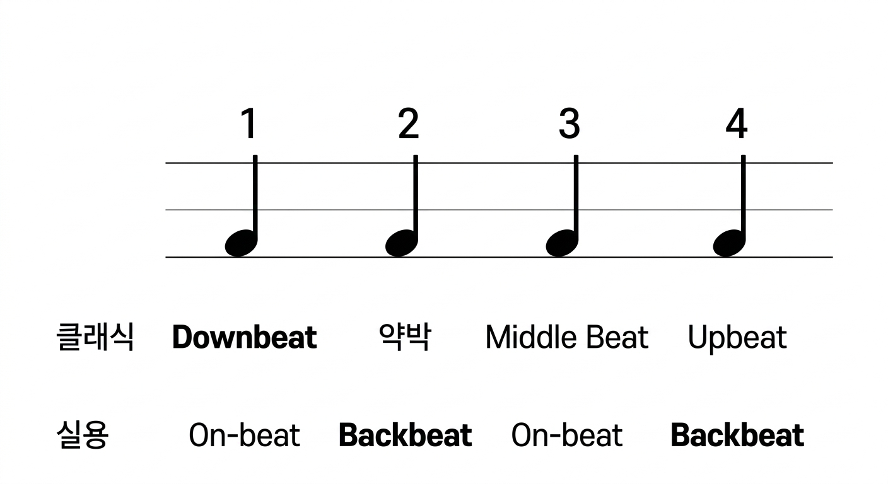
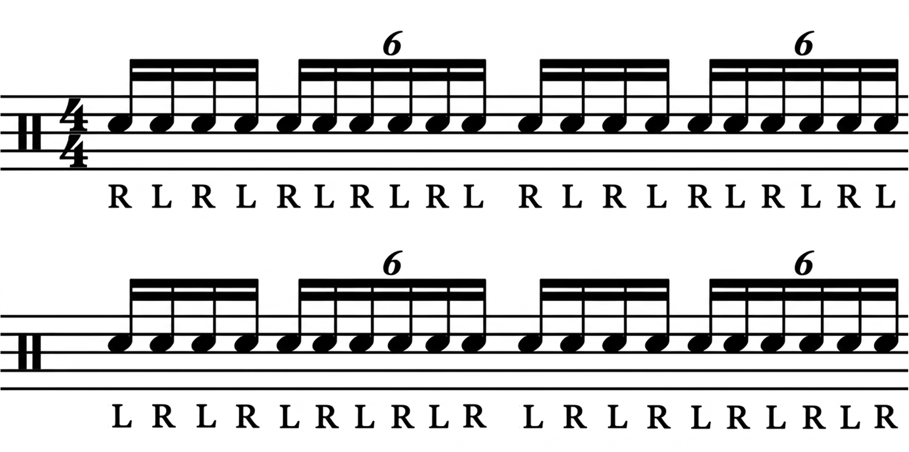

{fig-align=center}

## 기초

{fig-align=center}

---

### Stick control & Stroke

* CCM 드럼 = 팔 20 + 손목 50 + 손가락 30

{fig-align=center}

---

### Rudiments (PAS 40)

* 필수만 골라서 연습 [📥 전체 다운로드](files/VicFirth_RudimentsPoster_2016.pdf)
  + **Roll**(1, 2, 7, 8), **Diddle**(16, 24), **Flam**(20, 24), **Drag**(31, 32)

{fig-align=center}

---

### Rhythm

**악보**를 연주하는 것

{fig-align=center}

---

### Groove & Fill

**음악**을 연주하는 것

{fig-align=center}

---

### Song

{fig-align=center}

---

::: {.callout-important}

## 드러머가 하는 일

**CCM특: 곡의 주제는 성가(클래식)지만 [**형식은 팝 & 재즈(실용)**]()**

* **팝**처럼 2박과 4박을 분명하게 찍어줘서 **백비트**을 만들면 되긴 하는데, 
* **재즈**마냥 리더(인도자 or 교역자)와의 Call & Response가 가미된 **즉흥성**이 필요
:::

{fig-align=center}

## 매일 해야하는 숙제 3개

### 싱글 스트로크

::: {.callout-important appearance="simple"}
## 최종목표: BPM 175, 16회(32마디) 유지

16회 반복이 1세트, 틀리면 처음부터 다시, 하루 4세트
:::

{fig-align=center}

---

### 4 to 8 좌우 단련

::: {.callout-important appearance="simple"}
## 최종목표: BPM 100, 16회(32마디) 유지

16회 반복이 1세트, 틀리면 처음부터 다시, 하루 4세트
:::

{fig-align=center}

---

### 16분음표 국밥 패턴

::: {.callout-important appearance="simple"}
## 최종목표: 2배속 재생 완주

영상 1회 반복이 1세트, 틀리면 처음부터 다시, 하루 1세트
:::

::: {.r-stack}

:::

---

### 셋잇단음표 6연음 박자감 익히기

::: {.callout-important appearance="simple"}
## 최종목표: BPM 100, 16회(32마디) 유지

16회 반복이 1세트, 틀리면 처음부터 다시, 하루 4세트
:::

{fig-align=center}

---

## 리듬 연습

### 국밥

{fig-align=center}
