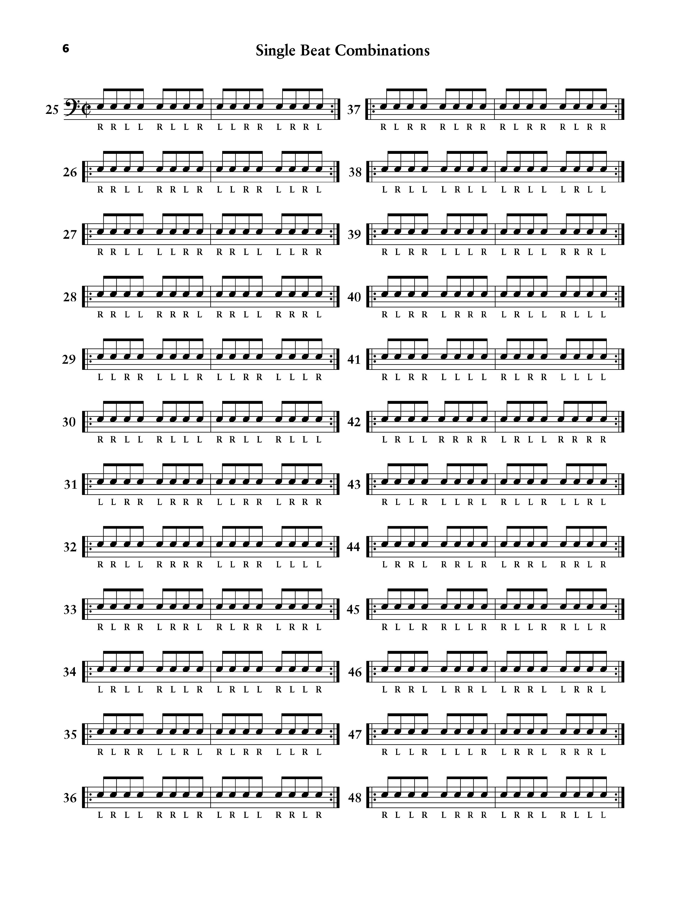
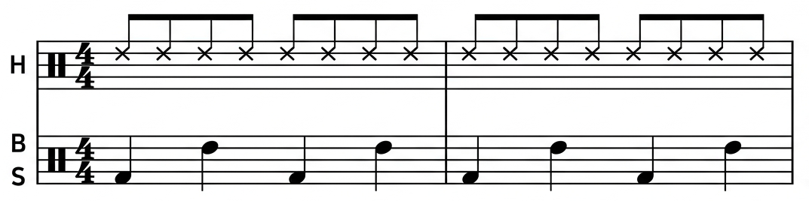

## 스틱 컨트롤 기초

::: {.callout-important}
## 각 악절(번호)당 16회 반복, 틀려도 계속하기, BPM 80

.pdf로 메모하면서 볼거면 [여기](files/weekpra01.pdf) 누르셈. 밑에 이미지 클릭은 커지기만 함.
:::

* 아마 진짜 지루하고 하품오는 순간 많을 거임. 
* 근데 이제 효과는 확실한. 꾹참고 해보셈. 
* 이거 이번주만 하고 안할거임. 
* 인생 살면서 딱 한번만 하고 넘어가는 연습임! 

 thanks me later 😎

{fig-align=center}

## 국밥 8비트 리듬 연습

{fig-align=center}

* 원래 드럼악보 이렇게 안쓰고 한줄에 다씀
* 지금은 보기 편하라고 나눠서 쓴거임
* 8비트만 칠줄 알아도 CCM 곡 35% 연주 가능