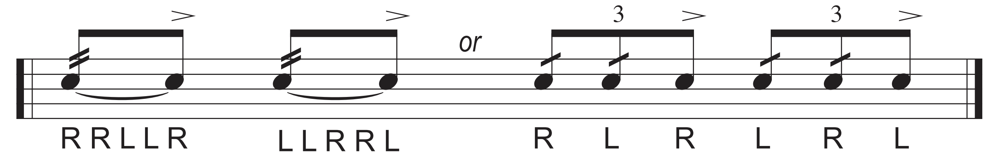
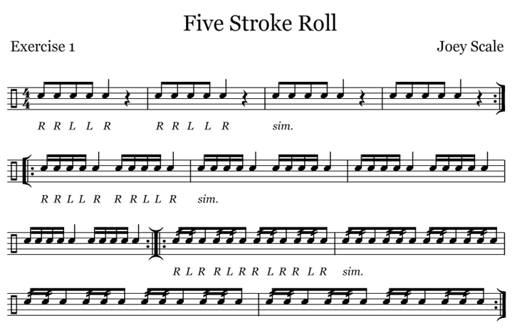

## Double Stroke Roll

이제 본격적으로 [루디먼트](files/VicFirth_RudimentsPoster_2016.pdf)를 공부할거임.

* 지난주까지 **Single Stroke 4**[^1]를 했음. 기억나지? RLRL
* 이제 **5-Stroke Roll** 을 할거임. 근데 별거 아님.

> 걍 5번 치는거 아님? 왜 굳이 [Roll](https://www.google.com/search?sca_esv=e926bb0053f95734&sxsrf=ANbL-n7KsH5Md8sXnI7RUpPxgXqGOyEBBQ:1776301004564&udm=2&fbs=ADc_l-bD_nyrjATWBKup7flJ4rea5XFXsPHwMjGsTekJ1HCohBAQ3Hh19DqzlO7wr7YUgTdA6AIvvuoLcS3uB5TUiBhAbf2Esh7hmQcamAOq029JiHMVyTbhrjhAYu-Ng82VW8WgGSFua2p2h-ay8dQzMPUF12fpxGg_kjM7behuJY0GIp3QHruE5Ck6GFaTDTWCtxdQUF0awmWcgOotu6jGd7fMOgEHHAUTd10yMw_XTMRmb5tdjn4&q=%EC%8A%A4%EC%8B%9C%EB%A1%A4&sa=X&ved=2ahUKEwj0qpDzlPGTAxW6sVYBHXvbOD4QtKgLegQIFRAB&biw=1432&bih=791&dpr=2)이라고 함?

드럼이라는 타악기의 특성 때문임. 

피아노는 걍 건반 꾹 누르면 손 뗄때까지 소리가 계속 이어짐. 근데 드럼은 안그럼. 드럼소리를 계속 sustain 하기 위해서는 뭔가를 해줘야함. 피아노처럼 딸깍~ 이 아님 ㅋㅋㅋ 갑자기 김민기 생각나네

**뭔가 돌멩이 굴리는 듯한 소리를 넣어보려는 시도가 Roll 인거임.**

---

그래서 단순히 5번 치는게 아니라 살살 4번 + 세게 1번 치는게 5-Stroke Roll임. 악보로 표현해보면 이럼.

마지막 5번째에 악센트 보이지? **도로로로 딱!** 소리를 내는게 목표임.[^2]

악보마다 표현하는게 조금씩 다름. **국룰은 아래 왼쪽그림임**. 위에는 이해를 돕기 위한 그림이고, 아래 오른쪽은 6-Stroke-Roll을 위한 떡밥임. 소리는 같음.

::: {.column-margin}
콩나물에 대각선으로 줄 그어놓은게 Double Stroke로 연주하라는 표시임. 2개 그어져있으면 Double Stroke를 2번 하라는 뜻.
:::

---

> 그럼 4-Stroke Roll은 왜 루디먼트에 없음? [**도로로**](https://namu.wiki/w/%EB%8F%84%EB%A1%9C%EB%A1%9C) **딱!** 같은거.

**양손이 더블 스트로크 하는 시점**부터 Roll이라고 부름. 

**도로로 딱!**은 앞의 도로로를 꾸밈음으로 해석하는게 국룰임. 나중에 할거임. 꾸밈음이 1개면 Flam, 2개면 Drag, 3개 이상이면 Ruff라고 함.[^3]

---

> 그래서 숙제가 머임?

* 이거 BPM 60으로 4회 반복하셈(도돌이표 포함해서)
  * 1, 2회는 악보대로
  * 3, 4회는 RL 반대로
  
* 단, **딱딱딱딱딱!** 말고 **도로로로 딱!**으로 (rrllR),
* 잘 모르겠으면 카톡하셈
* [이 영상](https://share.icloud.com/photos/0fciA6I61kCv_0j106Q6o01lw) 보면서 따라해두 됨

## 듣기 숙제

* ~~[이 악보]()를 **보면서** 음원 쭉 정주행하기(Welove 사랑을 나눠요).~~ 혹시 몰라서 악보 내림 약간쫄

만약 가능하다면 킥이랑 오른손만 악보를 따라해보면서 들어보자.

[^1]: {width=200px}

[^2]: 순서가 반대인 경우도 있음: **딱! 도로로로**

[^3]: 나중이고 뭐고 사실 이게 다임.